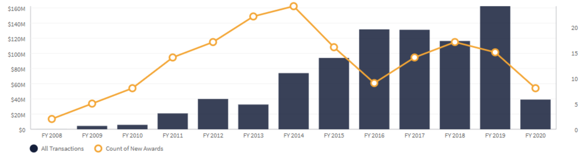

After Peter Thiel’s payment-processing company, PayPal, was acquired by eBay for \$1.5B in 2002, he began hunting for new problems to solve. He eventually settled on national security. Thiel believed PayPal’s fraud detection algorithms could be used to prevent terrorist attacks.1 He gathered several engineers, provided them with resources, and began looking for outside investors in the new company: Palantir.

Today, Palantir is one of the most valuable private companies in the world, providing data analytics tools to national security agencies in the US and UK. In search of growth, Palantir has also taken on private clients and non-federal government agencies. Its private business has churned through big names such as Coca-Cola, Home Depot, and American Express.2 As Palantir expanded, many began to question whether anti-terror tools should be applied so broadly. The company continues to attract headlines such as [Peter Thiel’s Creepy Tech Firm Is Helping The Government Track Coronavirus](https://www.vanityfair.com/news/2020/04/peter-thiels-creepy-tech-firm-is-helping-the-government-track-coronavirus), [Palantir Spreads Its Tentacles Throughout Europe](https://www.bloomberg.com/news/articles/2017-02-24/peter-thiel-s-palantir-spreads-its-tentacles-throughout-europe), and [Palantir Provides the Engine for Donald Trump’s Deportation Machine](https://theintercept.com/2017/03/02/palantir-provides-the-engine-for-donald-trumps-deportation-machine/).

Technological advancement, data privacy, and national security are three of today’s most hot-button public issues. Palantir combines those issues with an outspoken billionaire, border defense, private military contractors, law enforcement, and Silicon Valley origins. Few companies are more ripe for public scrutiny. Furthermore, as Palantir pushed aggressively into Europe, it demanded a greater sense of urgency from US technology companies and sparked a wider, international policy debate around the future of governance and warfare. The question remains, what exactly is Palantir trying to accomplish, and have they been successful?

In this essay, we will discuss Palantir’s ideology and its business. Then, we will break down the larger issues of digital privacy and private government contracting, discussing Palantir’s role in each. Finally, we will use the coronavirus outbreak as a case study for how these issues will continue to re-surface. In the coming years, new technologies will enable previously unthinkable abilities. It is vital that European authorities support the technological powers of the West in controlling these developments. As we will demonstrate, this includes, but is not limited to, Palantir.

# Palantir Background

### Palantir Philosophy

The two leaders of Palantir hold conflicting political views. Peter Thiel, its co founder and chairman, advocates for conservative thought and was the first prominent Silicon Valley executive to endorse Donald Trump in 2016.3 Alex Karp, its co founder and CEO, holds a PhD in neoclassical social theory, grew up protesting “anything Reagan did”, and proclaimed at a company meeting, “It would be hard to make up someone I find less appealing than Donald Trump.”4

Though contradictory at the level of political affiliation, Karp, Thiel, and Palantir as an organization are united behind their drive to support the system of liberal democracy, which allows for their differing beliefs. They believe this system is in danger. Karp has stated, “The present and future ability to control the rule of law will be determined by our ability to harness and master artificial intelligence and its precursor, machine learning.”5 Further, “Military AI will determine our lives. The country with the most important AI will determine the rules. That country should either be us (the United States) or a western country.”6 This philosophy, meant to uphold Western ideals and superiority, exacerbates the technological “cold war” between the United States and China.

As Palantir expanded aggressively into Europe, most notably the UK, many grew concerned that the company would control too much global security infrastructure. In response, Palantir has tried to position itself as a third-party provider of “tools,” not a means for outsourcing infrastructure.

### Palantir Products Simplify the Process of Analyzing Data

Scholars consider Palantir to be a “secondary surveillance network” because it extensively tracks interpersonal relationships between individuals, even those who are not suspected of any crimes. Its two main products are Palantir Gotham and Palantir Foundry. Gotham integrates and transforms data, regardless of type or volume, into a single coherent data asset. Once the data model is created, source data flows into the platform alongside the content users add. In Gotham’s Applications and Modules, users can search all data sources at once, explore divergent hypotheses, surface unknown connections and patterns, and share insights with their colleagues. Moreover, Palantir Gotham has been used in action with the US government multiple times. After Hurricane Florence caused \$17B in damage in the US, Gotham helped the communities in greatest need by combining publicly available flood data with weather information and social vulnerability census.7

Palantir Foundry redefines how people use data by removing barriers between back-end data management and front-end data analysis. Anyone can source, connect, and transform data into any shape they desire, and then use it to take action. The world’s leading organizations use Foundry to organize their infrastructure for better data collaboration across business units, dropping the cost of new data projects and creating better understanding of an organization’s data over time. In addition, Foundry combines automated data quality checks with tools for users to flag issues when they appear, upholding the data set’s integrity in the long run.8

The Palantir user guide shows that police can start with almost no information about a suspect and instantly find out intimate details of their lives. Using only a name associated with a license plate, they can use automatic license plate reader (ALPR) data to find out where and when the individual drove. With this one name, they can also obtain a person’s email, phone number, home address, bank account, social security number, and license information. Additionally, the software can map out family members and business associates of a suspect and extract all of the same information from them.

### Abundant UK Capital has become a Critical Focus in Driving Palantir Growth

Palantir is a highly secretive company. Although there have been doubts about its profitability globally, the firm seems to be succeeding in the UK, where it secured a $915 million contract to improve the government’s data management.9 Additionally, an employee of the company announced in 2019 that its London office is now its largest globally. Palantir recently secured a $35M contract from the Ministry of Defense last year, relating to “the provision and support of a search visualization and analysis system.10

Throughout the rest of Europe, Palantir is growing faster than ever, tripling annual revenue over the last three years. There are currently 800 Palantir employees stationed in Europe, holding contracts with governments in 30 countries.11 They recently secured two major deals in Europe: German healthcare giant Merck KGaA and French airplane manufacturer Airbus SE.12 To note, France recently renewed a 2016 contract with Palantir to supply software to its domestic intelligence services following the Paris terrorist attacks the previous year.

### Palantir’s Effect on Government Actions Validates Concerns

In the US, Palantir works extensively with federal, state, and local governments. Palantir sources and combines data from criminal activity logs and non-related sectors, like telecom, healthcare, and hospitality. This has drawn ire from civil liberties groups because it involves aggregating data from many different public and private entities. An example of Palantir’s use involves predictive policing in New Orleans, where studies show greater surveillance and arrests in communities of color. Interestingly, after the revelations of Edward Snowden, Palantir quickly denied that it had any connection to the NSA spy program PRISM; however, evidence suggests Palantir helped expand the NSA’s global spy network through the use of XKEYSCORE, one of the most expansive and intrusive tools of the NSA.13 Palantir also works with various military organizations and combat missions to collect information on enemy activity, track criminals, identify fraud, and plan logistics. It is even rumored to have been used to track down Osama Bin Laden.14

# Privacy in the Digital Age

### European Regulations Limit Palantir

Data privacy laws constitute a complex web that varies greatly between countries. In the US, there is no single law governing data protection. Rather, the FTC oversees various pieces of legislation which correspond to individual sectors and types of data&mdash;for example, medical data are protected under a different law than consumer spending data.15 The UK has much more centralized data privacy laws. The General Data Protection Regulation (GDPR), effective since 2018, has set the standard for data protection in the EU. GDPR aims to guarantee the right of individuals to retrieve (upon request) their personal data from private companies.16 Palantir has clearly found itself able to comply with the GDPR’s provisions, as it has been working with various European governments since the passing of the law.

Even the extensive data protection laws under GDPR have not eliminated concerns about Palantir. A 2019 partnership between Palantir and the UN’s World Food Programme immediately drew harsh criticism. The goal was to find ways to lower the cost of food relief by pooling and analyzing data. Opponents, however, spoke to the already vulnerable position of the individuals whose data would be utilized and declared that “the UN has put no frameworks in place to regulate it” (Privacy International).17

### Brexit and Data Protection

Since officially exiting the EU, the UK is no longer subject to the GDPR in its original form. Instead, the amended Data Protection Act of 2018 and the newly adopted UK-GDPR set the standard for data protection in the UK. Although the UK-GDPR is very similar to the EU’s GDPR, including the same principles and individual rights, some important changes were made. The UK-GDPR provides exceptions to when normal data protection can be bypassed, including “in matters of national security or in matters of immigration.18 Just as significant, the UK-GDPR will be overseen by the Information Commissioner (ICO) and the Secretary of State rather than the European Data Protection Board. The Secretary of State can overrule decisions made by the ICO and exercise supervisory authority.19

A whistleblower reported that a Palantir employee worked with Cambridge Analytica to gather Facebook data, with the goal to influence the elections of Trump and Brexit.20 Palantir eventually confirmed the report, saying the employee “engaged [with Cambridge Analytica] in an entirely personal capacity” and that they were looking to take “appropriate action."21

### Implications for US Law

European data protection laws mandate much more stringent restrictions than those in the US. Business leaders including Mark Zuckerberg have raised questions in recent years over whether the US should adopt similar legislation. The reporting consensus seems to be that an Americanized version of the GDPR would and should be much more limited in scope than that of Europe, if enacted at all.22 However, Palantir disagrees with the concept of increased legislation.

Palantir’s view is that Europe’s laws are too restrictive and are meant to punish American companies. Thiel declares that “there are no successful tech companies in Europe and they are jealous of the US,” which leads Europe to penalize companies for their data collection practices.23 On the other hand, Europe’s strict laws may prevent many potential companies from attempting to enter Palantir’s industry, thereby actually giving Palantir an advantage over local European competitors. The desire of the American government to produce more “home-grown” technological talent provides an argument against adopting standards such as the GDPR. Once again, the tradeoff between individual privacy and the economy/national security is thrown into sharp contrast. Protecting individuals’ data comes at the expense of gathering more technological capacity to track threats.

# Governments and Corporations

### The Story of Governments and Private Companies

The US government spends over $554B through contract, as of fiscal year 2018. In fact, the government spends “around 40% of total discretionary spending” on contracting.24 In FY 2018, the top 100 government contractors, on the federal level, had contracts worth $115 billion.25 In 2002, the top 100 had contracts worth just \$34B.26 Over these 16 years, the compound annual growth rate (CAGR) is strong at 8%. Palantir is a part of this trend; in fact, their revenue from the government has increased at a CAGR of 43.4% for the past 10 years.27 The graph below illustrates this pattern.

<small>Figure 1: Palantir’s US Contracts: dollar amount and number of contracts per year</small>

### How Contractors Operate within Governments

Many assume Edward Snowden worked for the NSA, but this was never the case. He instead worked for two contracting companies, Dell and Booz Allen Hamilton.28 The DoD has the largest budget out of all government agencies for contractual services, totaling over $389B.29 Hundreds of billions in contracting goes to purchasing goods and services related to military material, like aircrafts, ships, and missiles. The 17th largest spending category totals $3.57B and is for IT software.30 Within the category, Palantir is the 7th largest recipient, receiving \$68.8M in funds in 2019. Interestingly, only one other Silicon Valley firm is in the top. 3031

The government, operating on a slow pace of change, has not adapted to new models of contracting. All major military contractors procure goods and services the same way. For Palantir, this is not advantageous, as the processes for creating software differ drastically from military equipment. While this has most likely limited Silicon Valley technology companies serving as contractors, it showcases Palantir’s ambitions for transcending the gap and creating usable, data-driven software for governments.

### Palantir’s Politics in the UK

Palantir spent \$1.4M on lobbying in the US in 2019. In the US, there is an ongoing effort by Palantir to further incorporate its software through agencies across the government, from the DoD to health agencies, from the executive offices to Congress.32 In governments where there is indirect representation, such as the US and UK, special interests are more apt to dominate in the way a single voter cannot. Lobbying is recognized as a “far better use of corporate funds” than simply donating to candidates and the UK parliament website even advocates for individuals to collectivize for group lobbying.33 This has far-reaching effects.
In the UK, 50% of its contracts are of a “single source model”&mdash;essentially non-competitive contracts. Such contracts are overseen by the Single Source Regulations Office (SSRO). Created in 2014 as a new non-departmental public body, the SSRO has faced trouble establishing legitimacy with the UK Ministry of Defense: “of the 860 requests for information made by the watchdog to the MoD and the industry, only about 200 had been answered” in 2016.34 Palantir, as a company actively seeking government contracts, aptly spends money on lobbying to influence contract decision makers who provide recommendations, actions, and alignments that tie in with their own business-centered views.

### Outcome: Contractors Operating with Governments

Governments and contractors operate on different incentives. Companies predominately operate to generate a profit, while the role of government entails numerous other avenues, like service to citizens and protection of other entities (like businesses and risk mitigation) as Michael Lewis notes in “The Fifth Risk.” The difference in incentives creates a mismatch between contractors and the government itself completing certain work. For example, a study by the Project on Government Oversight found that contractors charged twice the amount that the US federal government pays to workers for similar services.35

Another aspect of difference is the fact that contractors do not abide by the same level of legislative oversight. This limits the checks and power balance as contractors can disclose less material and work around budgetary constraints proposed by Parliament. An example of this, from the US, is detailed in a NYT article:

> "The Obama administration has set a hard limit on the number of troops that can be deployed — it currently stands at 9,800. The Defense Department and State Department have, as a result, brought in thousands of contractors to do everything from serve food to analyze secret intelligence. There are currently believed to be about six contractors for every American government employee in Afghanistan."36

The practice of federal contracting entangles many different financial incentives across government agencies and private companies. Because contractors engage so closely with government institutions, they slowly change each other’s composition over time.

As a driving principle, Palantir believes “it's essential to preserve fundamental principles of privacy and civil liberties while using data."37 Fundamentally, Palantir recognizes its effect on shaping governments, albeit through a slow, often unrecognizable, pace. The company’s Director of Forward Deployed Engineering, Shyam Sankar, espouses such beliefs, stating, “institutions require people, and the people themselves are only as static as their motivations permit them to be."38

Palantir insists that its software acts on behalf of democratically elected leaders and it does not influence policy prescriptions. But policy does not travel on a one-way road to technology. If Palantir creates new technology for a government, the government adopts the new technology, then the technology shapes the institution over time. In this process, government representatives decide whether or not to adopt the technology. Any decision made today creates a policy for future decisions. Though this tight-knit relationship may be unpredictable and a bit precarious, it is hard to argue that the alternative, leaving the West’s government institutions without access to the best tools, would be better.

### Outcome: Contractors Not Operating with Governments

Unlike Palantir, some notable Silicon Valley companies have either explicitly or implicitly excused themselves from working with the US government.39 When Google employees protested the company’s involvement in Project Maven, the company responded by refusing to renew its contract.40 With this, the company is unable to affect change in accordance with its values. As a former senior DoD said, “AI is coming to warfare, so the question is, which American technologists are going to engineer it?"41

Google, let alone its employees, is now unable to alter US-led global standards to fit its worldview.42 As a company, it reserves the right to make this decision. With or without Google, hundreds of billions will be dispersed annually, and it is clear that other companies (e.g., Palantir, Amazon) are willing to step in and take the contracts. Ultimately, Google is not preventing the technologies from being built. They are merely forfeiting influence over the process.

### The Future through Palantir’s Eyes

In contrast, Palantir professes that it will supply software to any country with a functioning liberal democracy. Karp argues that a “motley crew of engineers in Silicon Valley” should not get to decide which policy prescriptions deserve Palantir’s support, but that Palantir backs the decisions of legislators and voters.43 The controversy surrounding Palantir’s work with US Immigration and Customs Enforcement (ICE) tested this commitment. Palantir began working with ICE under the Obama administration, but its work flew under the radar until March of 2017, when The Intercept published an article titled “Palantir Provides the Engine for Donald Trump’s Deportation Machine,” which outlined Palantir’s role in identifying illegal immigrants.44

The Intercept’s article provoked a fury of coverage surrounding Palantir and ICE, resulting in numerous protests at Palantir’s office and Alex Karp’s house. The controversy stirred internal debate at Palantir and, although several staff members resigned in disagreement, Palantir continued to provide technology to ICE. In its defense, Palantir has argued that ICE is a complex organization involving much more than the removal of illegal immigrants. In 2019 alone, ICE arrests resulted in 1,900 convictions for homicide, 1,800 convictions for kidnapping, and over 12,000 convictions for sex offenses.45 Ultimately, Palantir maintained its faith in the governmental system’s ability to provide checks and balances on ICE, but the contract remains controversial.

Further, Peter Thiel penned an op-ed in the New York Times in August 2019, going out of his way to attack Google and suggest that Google’s choice to avoid Project Maven is equivalent to abandoning the Manhattan Project.46 It is abundantly clear that Palantir’s concerns stem from China. In that same article, Thiel lambasted Google for continuing to operate its Chinese AI lab. In a separate talk, he argued, “When it comes to a decision between the US and China, it’s always the ethical decision to work with the US government...It’s really odd that we are having any sort of debate where that’s even framed as a question."47

Thiel has received criticism for apparent conflicts of interest, namely that Palantir stands to benefit from AI fear-mongering.48 But it is crucial to note that Google, if it chooses to reinstate its government work, would be directly competing with Palantir. After Google dropped Project Maven, Palantir actually took over the job.49 Palantir benefits from a lack of competitors in government contracting, and lower competition presumably lowers the bar for government work, hurting national institutions.

### East vs. West

Palantir’s concerns over technology advancements in the West are bolstered by recent developments in 5G internet infrastructure. China’s Huawei is the clear frontrunner in 5G, but the US banned its technology due to security concerns. America attempted to convince its allies to follow suit, but many (including the UK) have faltered and agreed to do business with Huawei.50 This should serve as a wake-up call for the West. The US cannot expect its allies to refrain from adopting powerful new technologies, even if there are serious risks. It must be able to provide a safe and competitive substitute.

In the end, Palantir’s commitment to supporting the West and abstaining from evaluating individual policies is its only option. Palantir makes military technology, and governments must know that Palantir will not pull the plug on critical wartime infrastructure just because its employees disagree with decisions outside their line of expertise.

# Coronavirus Case Study and Risks

### Palantir’s Response to COVID-19

It would be an oversight to discuss the future of privacy and national security without mentioning the impact of the novel coronavirus. As of April 30, 2020, COVID-19 had killed a reported 231,473 people.51 Governments from around the world have been forced to take drastic action in response. Palantir’s status as a government contractor places them at the forefront of the challenge on the technological end.

Palantir’s Foundry software has found a new application in the pandemic response. Previous domestic applications include studying food-borne illnesses and the effects of vaping. The newest enemy, the virus, is no different. Foundry uses patient information such as gender, age, health status, and location in order to predict COVID-19’s path and therefore allocate medical resources. Personal identifiers are stripped out.52

Palantir has been working with the governments of multiple countries to provide Foundry. Among those is the UK’s National Health Service (NHS), which, according to a government statement, is using the software to enable “‘disparate data to be integrated, cleaned, and harmonized in order to develop the single source of truth that will support decision-making.’”53 The government, aware of privacy concerns arising from Palantir’s controversial history and work with ICE, has tried to institute measures that will protect citizens’ privacy: all data will be anonymized, only provided in aggregate, and will be destroyed once the public health crisis ends.

Nonetheless, privacy rights activists remain unsatisfied. Privacy International made a statement pointing to past difficulties by Palantir clients in ending contracts.54 This concept of “vendor lock-in” is not exclusive to the UK - even the Pentagon may suffer from the same problem with Palantir and other contractors. A government sells data to a vendor and the vendor filters the data through a proprietary interface, making it impossible for the government to transition the same data for use by a different company. Instead, the contract is basically guaranteed to the same company in perpetuity.55 Palantir has been known for uncooperation in the past. The NYPD in 2017 wanted to end their 5-year contract with Palantir, but claimed to not have been given the previously analyzed information in a standardized format that will work with non-Palantir software. Palantir denied the accusation but yet admits to refusing to provide a way to translate some files, on the grounds of risking exposure of intellectual property.56 Likewise, the NHS’s partnership with Palantir may be more difficult to terminate than the UK government originally anticipated. Additionally, although the data is anonymized, concerns abound over whether this data or other data collected in the course of the pandemic will include personal identifiers in the future. Simply put, many people and organizations do not trust Palantir, and Palantir’s background gives them no reason to do so.

### Implications Beyond the UK

The UK’s actions with Palantir set a precedent for governments and national health services around the world. France, Germany, and Switzerland are all in talks to sign COVID-19 response contracts with Palantir, and other governments in Asia and Latin America have expressed interest.57 The conflicts of interest inherent in the widespread outsourcing of coronavirus response to Palantir are clear. Once Palantir is given control over such vast data sets, there is no guarantee that the data can ever be taken away.

Of course, the implications for Palantir’s involvement on a worldwide scale are not all bad. In the short-term, prediction power is the best weapon humans possess against COVID-19. By anticipating needs by geographical location, governments can more strategically allocate funding and supplies for medical personnel, coronavirus tests, and PPE.58 Even enduring partnerships with Palantir have benefits as well as risks. Countries which lack internally developed data analysis software at the same level of sophistication can apply Palantir software to other issues in their countries, from public health disasters to national defense. Doing so may garner more amicable feelings between the US government and the governments of other affected nations, as the public and private sectors collaborate towards a common goal of a more healthy worldwide population.

# Looking Forward

### Are Palantir’s Concerns Justified?

Palantir’s assessment of the AI landscape is somewhere between cautious and accurate. OpenAI is a leading research organization devoted to “discovering and enacting the path to safe artificial general intelligence (AGI).”59 Each year, OpenAI’s employees vote on the timeline for AGI, and half of the company believes it will arrive within fifteen years.60 Regardless of the timeline, most experts agree that AGI, when it arrives, will create exponential advances in intelligence and introduce new abilities we can’t currently comprehend or imagine.61 Elon Musk tweeted in 2017 that competition for AI superiority is the largest risk-factor for World War III.62

Concerns over AI are multiplied by the lack of technology companies working with Western governments. There are currently 465 private companies in the world valued at over \$1B. Only three of them (SpaceX, Palantir, and Anduril) work closely with Western governments on issues of national security. All three carry close connections to Peter Thiel, and two are named after Lord of the Rings artifacts. For reference, the list of billion-dollar start-ups includes two scooter companies (Bird and Lime), a salad company (Sweetgreen), two vaporizer companies (Pax and Juul), and a meditation app (Calm).

Thiel’s venture fund, FoundersFund, provided seed money to Anduril after its founder, Palmer Luckey, was ousted from Facebook surrounding controversy over his support for Donald Trump. One of Luckey’s cofounders, Trae Stephens, was an engineer at Palantir. Anduril’s website says that it “combines cutting-edge AI software with the latest hardware to solve complex national security challenges for America and its allies.”63 Additionally, SpaceX was founded by Thiel’s former co-worker at PayPal, Elon Musk. All three companies seek to change the relationship that defense contractors maintain with governments. Instead of collecting an up-front fee to develop and sell technology, each company owns its own systems and leases them to government agencies.64 This aligns incentives by encouraging the companies to keep costs down and not overpromise. However, Silicon Valley’s reluctance to innovate on behalf of Western governments has surrendered the future of defense technology to a relatively small sphere of influence.

# Summary - The Global Digital Divide

Palantir is one company. Yet, inside its secretive walls, the company embodies some of the most pressing conflicts facing the world today: public versus private sector, West versus East, privacy versus national security. Especially in times of emergency, the lines between the two sides in each debate begin to blur. Governments could not operate without the work of millions of private companies attracting talent and technology that only profitability can produce. Without the government, those very same companies would lose out on billions of dollars of revenue and funding to develop potentially life-saving innovations. The US government relies on Palantir for insights on everything from law enforcement to public health concerns, while Palantir benefits from the steady revenues of government agencies. Adherents to Western ideals possess a far-reaching distrust of any form of government other than liberal democracy, while regularly violating many of the same standards to which foreign governments are held in American eyes. For example, Huawei’s ban from operation in the United States represents a clear bias against the Chinese government’s data collection methods - the same methods which Edward Snowden revealed the NSA to perform.

And of course, the crux of the issue is whether national security or individual privacy takes precedence. Palantir was started in the wake of 9/11, when almost everyone agreed that, if any technology could have prevented the tragedy, that technology should have been used. Public sentiment fluctuates with time, but it is clear that the trend is towards less privacy, more technology. As new technologies have come along and promised greater comfort, convenience, and security, most have chosen to sacrifice their personal data for the sake of adoption. As long as this continues, elected leaders and experts must work with companies to ensure technological progress remains inside the bounds of the law. As citizens, we must encourage leaders to continually re-evaluate those legal boundaries and determine if they should be moved.

Palantir and its bombastic founder Peter Thiel have also shaped US defense technology by putting a private army on the task of spying for the world’s top superpower. As Palantir looks to expand beyond the US to American allies in Europe, the company’s track record raises concerns over how it could influence global surveillance. These concerns will only metastasize in the coming years as innovators in the East and the West discover military applications for powerful new technologies. In response, European authorities need to understand that exponential increases in the power of technology are on the horizon. Ignoring innovation will lead to ruin, and the West must convince all of its best minds to work together to create a future that preserves the separation of power, an open society, and civil liberties.

_<small>Brought to you by: Bilbo, Boromir, Aragorn, Legolas, and Arwen. Thanks for reading. </small>_

## Endnotes

<small>

1.  Greenberg, Andy, and Ryan Mac. “How A 'Deviant' Philosopher Built Palantir, A CIA-Funded Data-Mining Juggernaut.” Forbes, Forbes Media LLC., 14 Aug. 2013.

2.  Alden, William. “Inside Palantir, Silicon Valley's Most Secretive Company.” BuzzFeed News, 6 May 2016.

3.  Greenberg, Andy, and Ryan Mac. “How A 'Deviant' Philosopher Built Palantir, A CIA-Funded Data-Mining Juggernaut.” Forbes, Forbes Media LLC., 14 Aug. 2013.

4.  Alden, William. “Video Shows Palantir CEO Ridiculing Trump And Slamming His Immigration Rhetoric.” BuzzFeed News, 21 Apr. 2017.
5.  “Palantir CEO Alex Karp on Tech's Relationship with Government.” YouTube, 29 Aug. 2019.
6.  “Watch CNBC's Full Interview with Palantir CEO Alex Karp at Davos.” YouTube, 23 Jan. 2020.
7.  “Palantir Gotham.” Palantir, Palantir Technologies.
8.  “Palantir Foundry.” Palantir, Palantir Technologies.
9.  Chapman, Lizette, and Giles Turner. “Peter Thiel's Palantir Spreads Its Tentacles Throughout Europe.” Bloomberg, Bloomberg L.P., 24 Feb. 2017.
10. “Peter Thiel's Palantir Has Quietly Secured £39m of UK Government Deals.” Edited by Oscar Williams, NS Tech, 3 Dec. 2019.
11. Fouquet, Helene, and Albertina Torsoli. “Palantir in Talks with Germany, France for Virus-Fighting Tool.” Bloomberg, Bloomberg L.P., 1 Apr. 2020.
12. Chapman, Lizette, and Giles Turner. “Peter Thiel's Palantir Spreads Its Tentacles Throughout Europe.” BloombergQuint, Bloomberg Quint, 25 Feb. 2017.
13. Biddle, Sam. “How Peter Thiel's Palantir Helped the NSA Spy on the Whole World.” The Intercept, First Look Media, 22 Feb. 2017.
14. Chan, Rosalie. “Here's What You Need to Know about Palantir, the Secretive \$20 Billion Data-Analysis Company Whose Work with ICE Is Dragging Amazon into Controversy.” Business Insider, Insider Inc., 19 July 2019.
15. Chabinsky, Steven, and F. Paul Pittman. “USA Data Protection 2019: Laws and Regulations.” International Comparative Legal Guides International Business Reports, Global Legal Group, 7 Mar. 2019.
16. Burgess, Matt. “What Is GDPR? The Summary Guide to GDPR Compliance in the UK.” WIRED, WIRED UK, 24 Mar. 2020.
17. Parker, Ben. “New UN Deal with Data Mining Firm Palantir Raises Protection Concerns.” The New Humanitarian, 5 Feb. 2019.
18. “UK-GDPR: New UK Data Law after Brexit.” Cookiebot, 3 Feb. 2020.
19. Ibid.
20. Lomas, Natasha. “Palantir Confirms a Staff Link with Cambridge Analytica.” TechCrunch, Verizon Media, 28 Mar. 2018.
21. Pegg, David, and Carole Cadwalladr. “US Data Firm Admits Employee Approached Cambridge Analytica.” The Guardian, Guardian News and Media, 27 Mar. 2018.
22. Schulze, Elizabeth. “The US Wants to Copy Europe's Strict Data Privacy Law – but Only Some of It.” CNBC, CNBC LLC, 23 May 2019.
23. Jeong, Sarah. “No One's Ready for GDPR.” The Verge, Vox Media, LLC., 22 May 2018.
24. “Federal Government Contracting for Fiscal Year 2018 (Infographic).” WatchBlog: Official Blog of the U.S. Government Accountability Office, 31 May 2019.
25. “Washington Technology Daily.” Washington Technology.
26. “Washington Technology Daily.” Washington Technology.
27. “USAspending.gov.” USAspending.gov.
28. To note, the NSA is a sub-agency of the Department of Defense (DoD). Due to its secretive nature, contract awards for the NSA are not publicly reported.
29. This is around ⅔ of total contract awards for the federal government, as the US spends \$554B on contracting overall.
30. Classified by product codes: PSC code “7030 - Information Technology Software.” “USAspending.gov.” USAspending.gov.
31. New Tech Solutions, Inc., comes in at 29th, with \$17M. “USAspending.gov.” USAspending.gov.
32. Willis, Derek. “Represent.” ProPublica, 12 Aug. 2015.
33. Richter, Brian K. “Case Study: Do Business and Politics Mix?” Harvard Business Review, 19 Mar. 2015.
34. Hollinger, Peggy. “MoD Faces Pressure on Single-Source Procurement.” Subscribe to Read | Financial Times, Financial Times, 29 Jan. 2017.
35. Liebelson, Dana. POGO Study: Contractors Costing Government Twice as Much as In-House Workforce . Project on Government Oversight, 2011.
    Nixon, Ron. “Government Pays More in Contracts, Study Finds.” The New York Times, The New York Times, 13 Sept. 2011.
36. Rosenberg, Matthew. “At Booz Allen, a Vast U.S. Spy Operation, Run for Private Profit.” The New York Times, The New York Times, 7 Oct. 2016.
37. “Privacy & Civil Liberties Engineering.” Palantir.
38. “You Have to Engage with the World to Change It.” Shyam Sankar, 17 Aug. 2017.
39. “USAspending.gov.” USAspending.gov.
40. Helmore, Edward. “Hundreds of Google Employees Urge Company to Resist Support for Ice.” The Guardian, Guardian News and Media, 16 Aug. 2019.
41. Fryer-Biggs, Zachary. “Inside the Pentagon's Plan to Win Over Silicon Valley.” Wired, Conde Nast, 21 Dec. 2018.
42. Analysis adopted from Shakespeare’s “As You Like It:” “All the world's a stage, And all the men and women merely players: They have their exits and their entrances; And one man in his time plays many parts.”
43. Chafkin, Max. “Palantir CEO Alex Karp on Tech's Relationship with Government.” YouTube, 29 Aug. 2019.
44. Woodman, Spencer. “Palantir Provides the Engine for Donald Trump's Deportation Machine.” The Intercept, 2 Mar. 2017.
45. “ERO FY 2019 Achievements.” ICE, 24 Feb. 2020.
46. Thiel, Peter. “Good for Google, Bad for America.” The New York Times, The New York Times, 2 Aug. 2019.
47. “Panel 5 - 2019 Reagan National Defense Forum.” YouTube, ReaganFoundation, 7 Dec. 2019.
48. Piper, Kelsey. “Why an AI Arms Race with China Would Be Bad for Humanity.” Vox, Vox, 10 Aug. 2019.
49. Peterson, Becky. “Palantir Grabbed Project Maven Defense Contract after Google Left the Program: Sources.” Business Insider, Business Insider, 10 Dec. 2019.
50. Satariano, Adam. “Britain Defies Trump Plea to Ban Huawei From 5G Network.” The New York Times, The New York Times, 28 Jan. 2020.
51. “COVID-19 Coronavirus Pandemic.” Worldometer, Worldometers.info, 30 Apr. 2020, 2:15 PM
52. Chapman, Lizette. “Palantir's New 'Driving Thrust': Predicting Coronavirus Outbreaks.” Bloomberg.com, Bloomberg L.P., 2 Apr. 2020
53. Hatmaker, Taylor. “Palantir Provides COVID-19 Tracking Software to CDC and NHS, Pitches European Health Agencies.” TechCrunch, Verizon Media, 1 Apr. 2020
54. Macaulay, Thomas. “Fantastic! CIA-Funded Palantir Is Helping the NHS Plan Its Coronavirus Response.” Neural | The Next Web, 27 Mar. 2020
55. Atherton, Kelsey D. “Can the Pentagon Convince Silicon Valley to Move beyond Walled Gardens?” C4ISRNET, C4ISRNET, 27 Jan. 2019
56. Miller, Susan. “NYPD Struggles to Move Crime Analysis from Palantir to Home-Grown System.” GCN, 1105 Media, Inc., 6 July 2017
57. Chapman, Lizette. “Palantir's New 'Driving Thrust': Predicting Coronavirus Outbreaks.” Bloomberg.com, Bloomberg L.P., 2 Apr. 2020
58. Barnett, Jackson. “Inside Palantir's Work with the CDC, HHS to Synthesize COVID-19 Data.” FedScoop, 2 Apr. 2020
59. “OpenAI.” OpenAI, 2020.
60. Hao, Karen. “The Messy, Secretive Reality behind OpenAI's Bid to Save the World.” MIT Technology Review, MIT Technology Review, 17 Feb. 2020.
61. Urban, Tim. “The Artificial Intelligence Revolution: Part 2.” Wait But Why, 15 Nov. 2019.
62. Musk, Elon. “China, Russia, Soon All Countries w Strong Computer Science. Competition for AI Superiority at National Level Most Likely Cause of WW3 Imo.” Twitter, Twitter, 4 Sept. 2017.
63. “Anduril.” Anduril.
64. Levy, Steven. “Inside Anduril, Palmer Luckey's Bid to Build a Border Wall.” Wired, Conde Nast, 11 June 2018.

</small>
